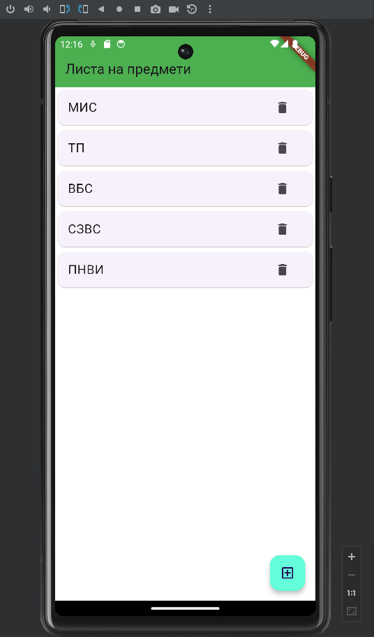

# lab1_mis

A new Flutter project.

## Getting Started

This project is a starting point for a Flutter application.

A few resources to get you started if this is your first Flutter project:

- [Lab: Write your first Flutter app](https://docs.flutter.dev/get-started/codelab)
- [Cookbook: Useful Flutter samples](https://docs.flutter.dev/cookbook)

For help getting started with Flutter development, view the
[online documentation](https://docs.flutter.dev/), which offers tutorials,
samples, guidance on mobile development, and a full API reference.

## Lab 1 
Инсталирајте го Flutter и соодветно IDE (Android Studio / VS Code) на вашиот компјутер и направете нов Flutter проект. Направете слика од екранот на вашиот проект, со крајниот резултат, во емулатор или симулатор. Насловот во делот AppBar да биде вашиот број на индекс. Направете листа со предметите кои ги слушате овој семестар, и овозможете функционалности додавање/бришење на предмети. Позадината нека биде во боја по ваш избор.

**Solution**

